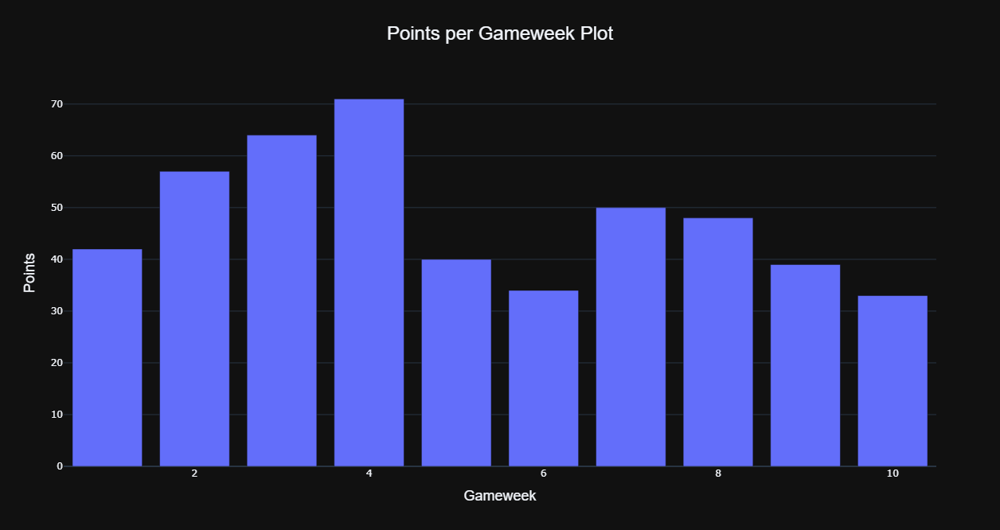

# pyPL

This project provides a Python library for retrieving and analyzing Fantasy Premier League (FPL) data. The library allows users to fetch detailed information about a FPL manager's performance, their leagues, and their gameweek statistics.

### Table of Contents

1. [Installation](#installation)
2. [Usage](#usage)
3. [Classes](#classes)
   - [FplCurrent](#fplcurrent)
   - [ClassicLeagues](#classicleagues)
   - [ActivePhases](#activephases)
   - [FplHistory](#fplhistory)
4. [Plots](#plots)
5. [Contributing](#contributing)
6. [License](#license)

---

## **Installation**

To use the `pyPL` library, clone the repository and install the necessary dependencies.

```bash
git clone https://github.com/RickyKimani/pyPL.git
```

```bash
cd pyPL
```

```bash
pip install -r requirements.txt
```

## **Usage**

Once the library is installed, you can import and use the classes to fetch FPL data.

You can run the `example.py` with your managerID to see your stats

## **Classes**

### FplCurrent

`FplCurrent` retrieves general information about a manager’s FPL profile, such as their name, rank, points, and leagues they are part of. You can also access information about the manager’s favorite league and more.

```bash
from fpl import FplCurrent

manager = FplCurrent(managerID=1234567)
print(manager.name)  # Manager's name
print(manager.summary_overall_points)  # Total points in the game
print(manager.favorite_team)  # Favorite team
```

### ClassicLeagues

`ClassicLeagues` allows you to access detailed information about a specific classic league that the manager is part of. It includes the league’s ID, name, rank, and other league-related statistics.

```bash
from fpl import ClassicLeagues

manager = ClassicLeagues(managerID=1234567, n=0)
print(manager.C_name)  # League name
print(manager.rank)  # League rank
```

### ActivePhases

`ActivePhases` retrieves detailed information about a specific active phase of a classic league. This includes the phase rank, points, total, and percentile rank within the league.

```bash
from fpl import ActivePhases

manager = ActivePhases(managerID=1234567, n=0, phase_number=1)
print(manager.A_rank)  # League rank in the current active phase
```

### FplHistory

`FplHistory` allows you to access historical data for a specific gameweek, including points, rank, and other relevant statistics for that week.

```bash
from fpl import FplHistory

history = FplHistory(managerID=1234567, gameWeek=5)
print(history.points)  # Points earned in gameweek 5
print(history.total_points)  # Total points up to gameweek 5
```

## **Plots**

You can use the data from the `FplHistory` class to plot beautiful bar charts using libraries like [`matplotlib`](C:\Users\rleah\pyPL-test\pyPL\plot-example\GWplot.png) and [`plotly`](https://plotly.com/python/).



The code to the plot can be found here:

[`Jupyter notebook`](./plot-example/points-plot.ipynb)

[`Normal python`](./plot-example/points-plot.py)

To view the [interactive plot](./plot-example/points-plot.html) 

[`HTML`]()


## **Contributing**

Contributions to pyPL are welcome! To contribute, fork the repository, create a branch for your feature or bug fix, and submit a pull request.

Props if you are blessed by the `numpy` gods and can optimise the code.

### **License**

This project is licensed under the MIT License - see the [LICENSE](LICENSE) file for details.
